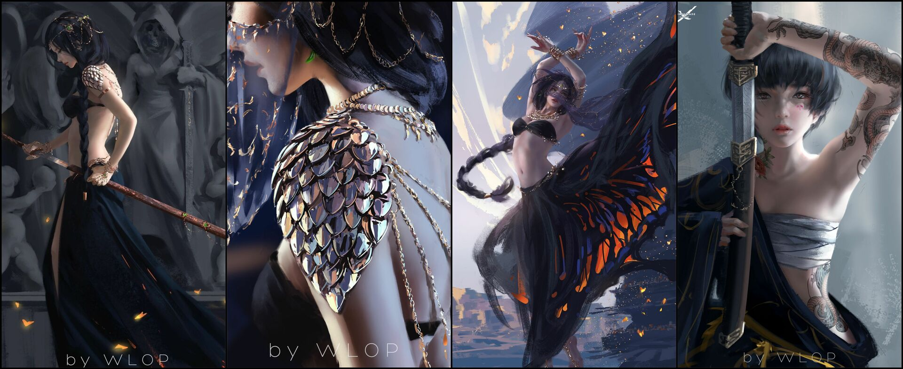

# PicoStitch - 在线图片拼接工具

**PicoStitch** 是一个强大、安全、纯客户端运行的在线图片拼接工具。它允许用户将多张图片以多种专业版式合并成一张长图，所有操作均在您的浏览器中完成，确保了100%的隐私和安全。

该项目从一个简单的HTML页面开始，通过与AI的持续迭代和协作，逐步演进为一个功能完善、性能流畅且交互友好的现代化Web应用。

---

## ✨ 核心功能

- **多种拼接模式**: 
  - **横向拼接**: 将图片水平排列。
<!-- @import "[TOC]" {cmd="toc" depthFrom=1 depthTo=6 orderedList=false} -->

  - **纵向拼接**: 将图片垂直排列。

- **高级对齐与裁剪**: 
  - **统一宽度模式**: 以最矮的图片为基准，裁剪其他过高图片的顶部和底部，确保视觉高度一致。
  - **统一高度模式**: 以最高的图片为基准，裁剪其他过宽图片的左侧和右侧，确保视觉宽度一致。
  - **固定尺寸裁剪填充**: 将多张图片完美填充到用户指定的最终尺寸中（如2560x1440），通过缩放和居中裁剪，实现无缝、无变形的专业版式。

- **灵活的尺寸控制**:
  - **等比缩放**: 可将最终图片等比缩放到预设的最大宽度或最大高度，避免变形。
  - **自定义宽度**: 支持用户输入自定义的宽度进行等比缩放。

- **精细化边框设置**:
  - **自定义宽度和颜色**: 自由设置边框的宽度和颜色。
  - **移除外层边框**: 可选只保留图片之间的边框，移除最外围的一圈边框。

- **流畅的交互体验**:
  - **多种上传方式**: 支持点击选择、拖拽文件和直接粘贴剪贴板中的图片。
  - **实时预览**: 在文件列表中生成并显示轻量级的图片缩略图，不影响性能。
  - **高效排序**: 支持点击“上/下移”按钮（DOM操作，无卡顿）和更直观的**拖拽把手**进行排序。
  - **实时数值反馈**: “质量”滑块旁会实时显示当前的数值。

- **现代化UI**: 
  - **Pico.css驱动**: 整体UI由轻量级的Pico.css框架驱动，简洁、优雅。
  - **主题切换**: 支持亮色(Light)、暗色(Dark)和自动(Auto)三种主题模式，并能记忆用户的选择。

- **客户端处理与性能**:
  - **100%安全**: 所有图片处理均在用户的浏览器中完成，图片文件不会被上传到任何服务器。
  - **性能优化**: 通过生成缩略图进行预览，极大地降低了内存占用，即使处理大量高清图片也能保持流畅。

- **结果输出**:
  - 清晰地显示输出结果的**尺寸（宽x高）**和**文件大小**。

## 🛠️ 技术栈

- **HTML5**: 负责页面结构。
- **CSS3**: 
  - 使用 **Pico.css** 作为核心UI框架。
  - 自定义少量样式以实现特定布局和组件美化。
- **JavaScript (Vanilla JS)**: 
  - 无任何外部JS框架依赖。
  - 使用 **HTML5 Canvas API** 完成所有核心的图片处理和绘制任务。
  - 使用 **FileReader API** 读取本地图片。
  - 使用 **localStorage** 存储用户的主题偏好。

## 🚀 如何使用

1.  直接在现代浏览器中打开 `index.html` 文件。
2.  根据您的需求，在页面上选择拼接模式、对齐方式、尺寸和边框等选项。
3.  通过点击按钮、拖拽或粘贴的方式添加您想要拼接的图片。
4.  在下方的文件列表中，通过拖拽或点击按钮来调整图片顺序。
5.  点击“合并”按钮，生成的结果会显示在页面下方。

## 效果演示

下面是使用 PicoStitch 生成的一些示例图片：

